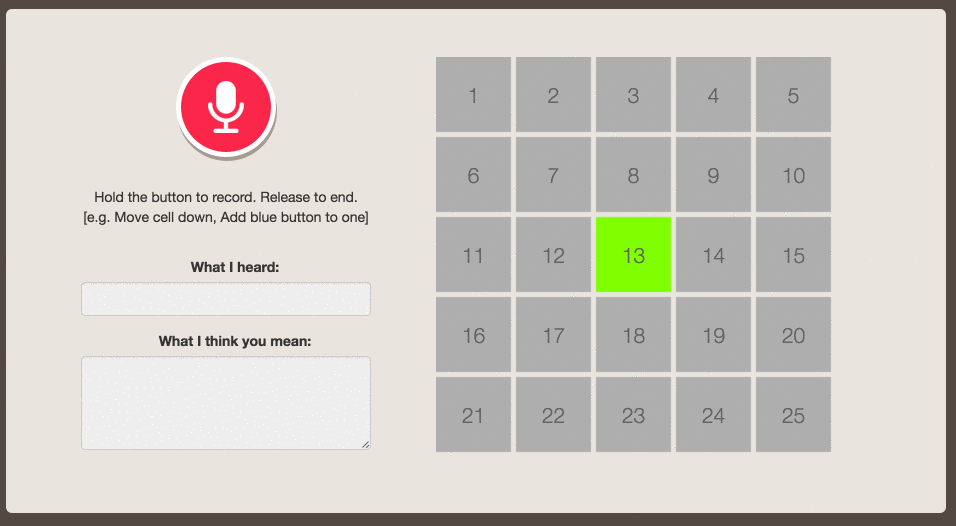

# Speech to Text Demo with Bing Speech and LUIS

_An application that updates its own user interface based on user's voice commands using speech recognition and machine learning_.

Ever wonder what it's like to have Jarvis from Iron Man? Well now with the advances in machine learning and speech recognition, what if we build web applications with something like Jarvis? This is a simple proof of concept that demonstrates how users can now build web UIs with simple voice commands.

This application is built using RecorderJS to record audio, [Bing Speech API](https://www.microsoft.com/cognitive-services/en-us/speech-api/documentation/overview) to recognize user's voice commands while it also uses [LUIS](https://www.microsoft.com/cognitive-services/en-us/luis-api/documentation/home) (Language Understanding Intelligent Services) to understand the user's intentions, which are interpreted and used for updating cells in a web user interface. 

## Installation

Clone this repo and then install dependencies:

    git clone https://github.com/ritazh/sttdemo.git
    cd sttdemo
    npm i

Run the application then hit your browser with `http://localhost:3000`:

    node app.js

Setup your own keys for Bing Speech and LUIS:

* Sign up for Microsoft Cognitive Service [here](https://www.microsoft.com/cognitive-services/en-us/sign-up) and get your keys for Speech API
* Follow the steps [here](https://www.microsoft.com/cognitive-services/en-us/luis-api/documentation/getstartedwithluis-basics) to create your own LUIS app, then get your LUIS application id and your LUIS Subscription-key.
* To get the same trained LUIS app for moving cells, you can also import an existing app by using [cellmover.json](cellmover.json). 
* To get the same context trained by CRIS, you can upload [cris.json](cris.json) to create your own language model. 

## Acknowledgement
Many thanks to [@rickbarraza](@rickbarraza) for designing and developing the user interface for this application.

Many thanks to [@cwilso](@cwilso) for developing and maintaining [AudioRecorder](https://github.com/cwilso/AudioRecorder) for the awesome UI components in this app.

## License
Licensed using the MIT License (MIT); Copyright (c) Microsoft Corporation. For more information, please see [LICENSE](LICENSE).
